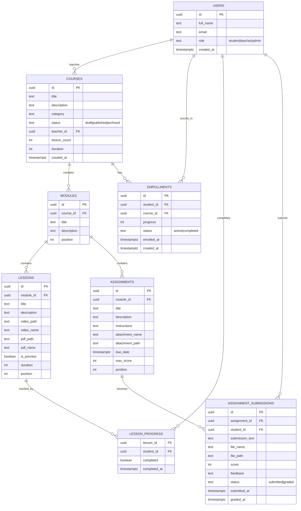

# Nexora — Technical Documentation

> AI-powered collaborative learning platform built with React, Supabase, and modern web technologies.

---

## 1. Project Overview

Nexora is a collaborative learning management system (LMS) that connects teachers, students, and administrators. Teachers create courses with structured modules and lessons. Students enroll, learn at their own pace, complete assignments, and receive grades. Admins oversee the entire platform.

The platform handles the full lifecycle: course creation → enrollment → learning → assignments → submissions → grading.

---

## 2. Goals & Scope

**In Scope (MVP)**
- User authentication and role-based access (student, teacher, admin)
- Course creation and management
- Module and lesson structure with video/PDF content
- Assignment creation, submission, and grading
- Enrollment and progress tracking
- Dashboard for each role with real-time data

**Out of Scope (Not Yet Built)**
- Quizzes and assessments
- AI-powered tutoring
- Real-time notifications
- Email notifications
- Payment processing
- Rich text editor for assignments
- Discussion forums

---

## 3. Users & Roles

| Role | Capabilities |
|------|-------------|
| **Student** | Browse courses, enroll, view lessons, submit assignments, track progress |
| **Teacher** | Create/edit/delete courses, create modules/lessons/assignments, grade submissions, view enrolled students |
| **Admin** | Manage all courses, view platform stats, manage users, manage enrollments, view role distribution |

Each user has a single role. Role determines dashboard layout, sidebar navigation, and route access.

---

## 4. Technology Stack

| Layer | Technology | Purpose |
|-------|-----------|---------|
| Frontend | React 19 | UI components and state management |
| Build | Vite 8 | Dev server and production bundler |
| Styling | Tailwind CSS v4 | Utility-first CSS via `@tailwindcss/vite` |
| State | Redux Toolkit | Global state, async thunks, Redux slices |
| Forms | React Hook Form | Form validation and handling |
| Routing | React Router v8 | Client-side routing with nested layouts |
| Backend | Supabase | Auth, database (PostgREST), storage |
| Database | PostgreSQL | Relational data storage |
| Linting | ESLint | Code quality (flat config) |

---

## 5. System Architecture

Nexora is a frontend-only React application. All backend logic is handled by Supabase.

```
┌─────────────────────────────────────────────────────────┐
│                     React Application                    │
│  ┌─────────────┐  ┌──────────────┐  ┌───────────────┐  │
│  │    Pages     │  │  Components  │  │    Redux      │  │
│  │  (Routes)    │  │  (Reusable)  │  │  (Slices)     │  │
│  └──────┬──────┘  └──────┬───────┘  └───────┬───────┘  │
│         │                │                   │           │
│         └────────────────┼───────────────────┘           │
│                          │                               │
│                  ┌───────▼────────┐                      │
│                  │  Service Layer  │                      │
│                  │  (API calls)    │                      │
│                  └───────┬────────┘                      │
└──────────────────────────┼──────────────────────────────┘
                           │
              ┌────────────▼────────────┐
              │        Supabase         │
              │  ┌─────┐ ┌───────────┐  │
              │  │Auth │ │PostgREST  │  │
              │  └─────┘ │(PostgreSQL)│  │
              │          └───────────┘  │
              │  ┌───────────────────┐  │
              │  │    Storage        │  │
              │  │  (5 buckets)      │  │
              │  └───────────────────┘  │
              └─────────────────────────┘
```

**Data flow:** Components dispatch Redux thunks → thunks call service functions → services call Supabase → Supabase returns data → Redux updates state → components re-render.

---

## 6. Application Structure

```
src/
├── config/conf.js                          # Environment variables
├── store/store.js                          # Redux store configuration
├── constants/pagination.js                 # Shared constants (COURSE_PAGE_SIZE = 6)
├── hooks/useKeyboardShortcuts.js           # Learning page keyboard shortcuts
├── utils/                                  # Helper functions (formatDate, submissionTiming, etc.)
├── services/supabase/
│   ├── supabaseClient.js                   # Supabase client instance
│   ├── auth/auth.service.js                # Auth, profile, user management
│   ├── course/
│   │   ├── course.service.js               # Course CRUD, stats
│   │   └── course.storage.js               # Thumbnail uploads
│   ├── enrollment/enroll.service.js        # Enrollment operations
│   ├── module/module.service.js            # Module CRUD, reordering
│   ├── lesson/
│   │   ├── lesson.service.js               # Lesson CRUD
│   │   ├── lesson.storage.js               # Video/PDF uploads
│   │   └── lessonProgress.service.js       # Progress tracking
│   └── assignment/
│       ├── assignment.service.js           # Assignment CRUD
│       ├── assignment.storage.js           # Attachment uploads
│       ├── submission.service.js           # Submission CRUD, grading
│       └── submission.storage.js           # Submission file uploads
├── features/
│   ├── auth/                               # Auth state, AuthInitializer
│   ├── course/                             # Course state + thunks
│   ├── enroll/                             # Enrollment state + thunks
│   ├── module/                             # Module state + thunks
│   ├── lesson/                             # Lesson state + thunks
│   ├── lessonProgress/                     # Progress state + thunks
│   └── assignment/                         # Assignment + submission state
├── pages/                                  # Route-level components (20+ pages)
├── components/
│   ├── index.js                            # Barrel export (53 components)
│   ├── Dashboard/                          # Sidebar, headers, content pages
│   ├── Course/                             # Course cards, forms, curriculum editor
│   ├── StudentLearning/                    # Learning sidebar, video player, PDF viewer
│   └── Header/                             # Public header, avatar dropdown
└── index.css                               # Tailwind v4 @theme tokens
```

**Conventions:**
- Barrel exports: `src/components/index.js` and `src/pages/index.js`
- Feature folders: each feature has a slice + service(s)
- JSX, not TSX: all components are `.jsx`
- ES modules: `"type": "module"` in package.json

---

## 7. Database Design

### 7.1 Database Overview

The Supabase PostgreSQL database contains 8 tables organized around courses, modules, lessons, assignments, and enrollments. Foreign keys enforce referential integrity.

### 7.2 ER Diagram



### 7.3 Tables & Relationships

| Table | Purpose | Key Relationships |
|-------|---------|-------------------|
| `users` | User profiles | Referenced by all other tables |
| `courses` | Course catalog | `teacher_id` → `users.id` |
| `modules` | Course structure | `course_id` → `courses.id` |
| `lessons` | Learning content | `module_id` → `modules.id` |
| `assignments` | Assessment tasks | `module_id` → `modules.id` |
| `enrollments` | Student-course links | `student_id` → `users.id`, `course_id` → `courses.id` |
| `lesson_progress` | Completion tracking | `lesson_id` → `lessons.id`, `student_id` → `users.id` |
| `assignment_submissions` | Student submissions | `assignment_id` → `assignments.id`, `student_id` → `users.id` |

### 7.4 Row Level Security

Supabase RLS policies enforce access control at the database level:

| Table | Policy | Access |
|-------|--------|--------|
| `users` | Read: authenticated users | All roles can read |
| `users` | Write: own profile only | Users can update their own `full_name` |
| `courses` | Read: published courses | Public read for published; teachers/admins read all |
| `courses` | Write: owner or admin | Teachers can modify their own; admins can modify any |
| `enrollments` | Read: own enrollments | Students see own; teachers see course enrollments |
| `enrollments` | Write: own enrollment | Students can enroll/unenroll; system updates progress |
| `modules` | Read: course modules | Public read for published course modules |
| `lessons` | Read: module lessons | Students see published; teachers see all |
| `assignments` | Read: module assignments | Students see published; teachers see all |
| `assignment_submissions` | Read: own or graded | Students see own; teachers see submissions for their assignments |
| `assignment_submissions` | Write: own submission | Students can create/update their own |
| `lesson_progress` | Read: own progress | Students see own; teachers see enrolled students |

---

## 8. Authentication & Authorization

### Auth Flow

```
App Mount → AuthInitializer → Supabase.getSession()
  → If session exists: fetch user profile from `users` table → dispatch login(profile)
  → If no session: set isLoading = false
  → Subscribe to onAuthStateChange for token refresh
```

### Route Guards

- **`ProtectedRoute`** (`AuthLayout.jsx`): Checks `state.auth.isAuthenticated`
  - `requireAuth={true}`: redirects unauthenticated users to `/login`
  - `requireAuth={false}`: redirects authenticated users away (used for login/signup pages)

- **`RoleRoute`** (`ServiceLayout.jsx`): Checks `state.auth.userData.role`
  - `allowedRoles={["teacher"]}`: only teachers (and admins) can access
  - Redirects unauthorized users to `/dashboard`

### Role Detection

Role is stored in the `users` table and loaded into Redux at auth initialization:
```js
state.auth.userData.role // "student" | "teacher" | "admin"
```

---

## 9. Core Features

### 9.1 Courses

**Teacher:** Create, edit, delete courses. Set title, description, category, status (draft/published/archived). Upload thumbnails. Manage curriculum (modules, lessons, assignments).

**Student:** Browse published courses in catalog. View course details with curriculum preview. Enroll to access learning content.

**Admin:** View all courses across platform. Edit/delete any course. View course stats (published/draft/archived counts).

### 9.2 Modules

Modules are containers within a course that organize content sequentially.

- Teachers create/reorder/edit/delete modules
- Each module has a position for ordering
- Modules contain lessons and assignments
- Reordering updates all positions in a batch

### 9.3 Lessons

Lessons are the learning units within modules. Each lesson has:

- **Video content**: uploaded to Supabase Storage (`lesson-videos` bucket)
- **PDF content**: uploaded to Supabase Storage (`lesson-files` bucket)
- **Duration**: in seconds, used for course total duration calculation
- **Preview flag**: whether non-enrolled users can view the lesson

### 9.4 Assignments

Assignments are assessment tasks attached to modules.

**Teacher workflow:**
1. Create assignment with title, description, instructions
2. Set due date, max score, position
3. Optionally attach a file (instructions document)
4. Edit or delete as needed

**Student workflow:**
1. View assignments in learning page sidebar
2. Read instructions and download attachments
3. Submit response (text + optional file)
4. View submission status and grade

### 9.5 Assignment Submissions

Students submit assignments via text and/or file upload.

- **File storage**: uploaded to `submission-files` bucket with path `{userId}/{timestamp}-{sanitized-name}.{ext}`
- **Status**: `submitted` → `graded` (after teacher grades)
- **Late submissions**: tracked via `submitted_at` vs assignment's `due_date`
- **Late label**: computed by `submissionTiming.js` utility ("2h 15m late", "1d 3h late")

### 9.6 Grading

Teachers grade submissions from the Grade Center or assignment detail page.

- Set score (0 to max_score) and feedback
- Status auto-updates to "graded" with timestamp
- Grade Center shows all submissions across assignments with search/filter
- Course column shows which course each submission belongs to

---

## 10. Assignment Workflow

### Creation Flow (Teacher)

```
Teacher → Clicks "Create Assignment" on module
  → Fills form (title, description, instructions, due date, max score)
  → Optionally attaches file → file uploaded to assignment-files bucket
  → Submit → assignment record created in database
  → If DB insert fails → uploaded file deleted (rollback)
```

### Submission Flow (Student)

```
Student → Views assignment detail
  → Reads instructions, downloads attachment (signed URL)
  → Writes response text
  → Optionally attaches file → file uploaded to submission-files bucket
  → Submit → submission record created in database
  → If DB insert fails → uploaded file deleted (rollback)
```

### Grading Flow (Teacher)

```
Teacher → Opens Grade Center or clicks "Grade" on assignment
  → Sees submission with text, file link, late status
  → Downloads file (signed URL, 1-hour expiry)
  → Enters score and feedback
  → Submit → submission updated: score, feedback, status="graded", graded_at
  → Student sees grade in their assignment view
```

### File Download Flow

Both assignment attachments and submission files use **signed URLs** with 1-hour expiry for security:

1. Component calls `getAttachmentUrl(path)` or `getSubmissionUrl(path)`
2. Service calls `supabase.storage.from(bucket).createSignedUrl(path, 3600)`
3. Returns signed URL to component
4. Component renders link with the signed URL

---

## 11. Service Layer

### Architecture

All services are implemented as **singleton class instances** exported as default:

```js
// Example from auth.service.js
class AuthService {
  async signUp(email, password, fullName, role) { ... }
  async signIn(email, password) { ... }
  // ...
}

const authService = new AuthService();
export default authService;
```

Services are imported directly, not through Redux:
```js
import authService from "../../services/supabase/auth/auth.service";
```

### Key Service Groups

| Service | Responsibility |
|---------|---------------|
| `auth.service.js` | Sign up/in/out, session management, profile, user stats, admin user management |
| `course.service.js` | Course CRUD, stats, teacher/admin queries |
| `course.storage.js` | Thumbnail uploads to `course-thumbnails` bucket |
| `enroll.service.js` | Enroll/unenroll, check enrollment, progress updates |
| `module.service.js` | Module CRUD, position reordering |
| `lesson.service.js` | Lesson CRUD, position reordering |
| `lesson.storage.js` | Video/PDF uploads to storage buckets |
| `lessonProgress.service.js` | Mark complete/incomplete, fetch progress |
| `assignment.service.js` | Assignment CRUD, position reordering |
| `assignment.storage.js` | Attachment uploads, signed URLs |
| `submission.service.js` | Submission CRUD, grading, teacher queries |
| `submission.storage.js` | Submission file uploads, signed URLs |

### Assignment Service (Deep Dive)

```
assignment.service.js
├── createAssignment({ title, moduleId, description, instructions,
│                      attachmentName, attachmentPath, dueDate, maxScore, position })
├── updateAssignment({ assignmentId, assignmentData })
├── deleteAssignment({ assignmentId }) — also deletes storage file
├── getAssignment({ assignmentId }) — joins modules → courses
├── getModuleAssignments({ moduleId })
├── getCourseAssignments({ courseId }) — joins modules
├── getMyAssignments() — teacher's assignments across all their courses
└── updateAssignmentPositions({ reorderedAssignments }) — batch update
```

---

## 12. Storage & File Uploads

### Supabase Storage Buckets

| Bucket | Contents | Access |
|--------|----------|--------|
| `course-thumbnails` | Course thumbnail images | Public URL |
| `lesson-videos` | Lesson video files | Public URL |
| `lesson-files` | Lesson PDF files | Public URL |
| `assignment-files` | Assignment attachments | Signed URL (1hr) |
| `submission-files` | Student submissions | Signed URL (1hr) |

### File Path Convention

All file paths follow: `{userId}/{timestamp}-{sanitized-name}.{ext}`

Example: `a1b2c3d4-.../1719876543210-midterm-exam.pdf`

### Upload Pattern with Rollback

For assignment creation and submission, files are uploaded first, then the database record is created. If the DB insert fails, the uploaded file is deleted:

```
1. Upload file → get filePath
2. Insert DB record with filePath
3. If DB fails → delete uploaded file
4. If DB succeeds → return record
```

---

## 13. Security

### Authentication

- Supabase Auth handles email/password authentication
- JWT tokens managed automatically by Supabase client
- `AuthInitializer` validates session on app mount

### Authorization

- Route-level: `ProtectedRoute` checks authentication, `RoleRoute` checks role
- Component-level: sidebar shows only relevant menu items per role
- Service-level: some queries filter by `teacher_id` or `student_id`

### Data Access

- Students can only see their own submissions and enrollments
- Teachers can only see submissions for assignments in their courses
- Admins can see all data across the platform
- RLS policies enforce these rules at the database level

### File Security

- Assignment attachments and submission files use **signed URLs** (1-hour expiry)
- Course thumbnails and lesson files use **public URLs** (less sensitive content)

---

## 14. Engineering Decisions

### Decision 1 — Why Supabase?

**Decision:** Use Supabase as the complete backend.

**Reason:** Supabase provides auth, database (PostgREST), and storage in a single platform. It integrates naturally with React and reduces infrastructure complexity for an MVP.

**Alternative:** Firebase, Auth0 + separate PostgreSQL, custom Node.js backend.

**Why not:** Firebase's NoSQL model doesn't fit relational data well. Auth0 + separate DB adds integration overhead. Custom backend requires hosting and maintenance.

---

### Decision 2 — Optimistic Updates for Lesson Progress

**Decision:** Use optimistic updates for marking lessons complete/incomplete.

**Reason:** The action feels instant to the user — the checkbox toggles immediately. If the server call fails, the UI rolls back.

**Alternative:** Wait for server response before updating UI.

**Why not:** Feels sluggish on slow connections. Lesson progress is low-risk — a failed update can be retried.

---

### Decision 3 — Late Submission Option B

**Decision:** Allow late submissions but mark them with a "late" label.

**Reason:** Students can still submit work but teachers see the timing. More flexible than rejecting late work entirely.

**Alternative (Option A):** Reject submissions after the deadline.

**Why not:** Too restrictive for a learning platform. Students might have legitimate reasons for being late.

---

### Decision 4 — Signed URLs for Assignment/Submission Files

**Decision:** Use signed URLs with 1-hour expiry for assignment attachments and submission files.

**Reason:** These files contain academic work and shouldn't be publicly accessible. Signed URLs provide time-limited access.

**Alternative:** Public URLs (like lesson videos).

**Why not:** Public URLs would expose student submissions and assignment materials to anyone with the link.

---

### Decision 5 — PostgREST 3-Level Join Workaround

**Decision:** Use two-step queries for 4+ level joins instead of trying to filter on deeply nested joins.

**Reason:** PostgREST silently returns empty arrays when filtering on joins 3+ levels deep. Two-step queries work reliably.

**Alternative:** Denormalize data (store redundant columns).

**Why not:** Denormalization adds complexity and data consistency issues. Two-step queries are simpler and more maintainable.

---

## 15. Error Handling

### Redux Error State

Each Redux slice has an `error` field:
```js
{
  loading: false,
  error: null, // or "Failed to fetch courses"
}
```

### UI Error Display

- **Dashboard pages**: Show inline message banners (success/error) with auto-dismiss
- **Loading states**: Spinner components during async operations
- **Empty states**: Placeholder messages when no data exists

### Service-Level Error Handling

Services use try/catch and throw errors to callers:
```js
async createAssignment(data) {
  const { error } = await supabase.from("assignments").insert(data);
  if (error) throw new Error(error.message);
}
```

### Rollback Pattern

For operations that upload files + create DB records:
```
Upload file → Insert DB record → If DB fails → Delete uploaded file
```

---

## 16. Performance Considerations

- **Pagination**: All list views use pagination (10 items per page for admin, 6 for courses) to limit data fetched
- **Optimistic updates**: Lesson progress updates feel instant
- **Barrel exports**: Reduce import verbosity, allow tree-shaking
- **Supabase joins**: Use PostgREST foreign key joins to fetch related data in single queries where possible
- **Lazy loading**: Vite handles code splitting at the route level
- **Signed URL caching**: 1-hour expiry reduces repeated storage requests

---

## 17. Setup & Local Development

### Prerequisites

- Node.js 18+
- npm or yarn
- A Supabase project (URL + anon key)

### Installation

```bash
# Clone the repository
git clone https://github.com/your-username/nexora.git
cd nexora

# Install dependencies
npm install

# Create .env file
cat > .env << EOF
VITE_SUPABASE_URL=your_supabase_url
VITE_SUPABASE_PUBLISHABLE_KEY=your_supabase_anon_key
EOF

# Start development server
npm run dev
```

### Available Commands

| Command | Description |
|---------|-------------|
| `npm run dev` | Start Vite dev server |
| `npm run build` | Production build |
| `npm run lint` | Run ESLint |
| `npm run preview` | Serve production build locally |

---

## 18. Environment Variables

| Variable | Description | Source |
|----------|-------------|--------|
| `VITE_SUPABASE_URL` | Supabase project URL | Supabase dashboard → Settings → API |
| `VITE_SUPABASE_PUBLISHABLE_KEY` | Supabase anon/public key | Supabase dashboard → Settings → API |

These are accessed via `import.meta.env.VITE_*` through `src/config/conf.js`.

---

## 19. Deployment

### Live

**Production:** [nexora-learning.vercel.app](https://nexora-learning.vercel.app)

### Frontend Deployment

Nexora is a static React application. Deploy to any static hosting:

- **Vercel**: Connect GitHub repo, auto-deploy on push
- **Netlify**: Connect GitHub repo, set build command to `npm run build`
- **GitHub Pages**: Add `base` to `vite.config.js`

### Environment Configuration

Set environment variables on your hosting platform:
- Vercel: Settings → Environment Variables
- Netlify: Site settings → Environment variables

### Build Output

`npm run build` produces a `dist/` folder with:
- `index.html` (entry point)
- `assets/` (JS, CSS, SVGs)

Upload `dist/` to any static host.

---

## 20. Known Limitations

| Limitation | Impact |
|------------|--------|
| No quiz system | Only assignment-based assessment |
| No real-time features | No live notifications or collaboration |
| No email notifications | Users must check platform manually |
| No rich text editor | Assignments use plain text/markdown |
| No file previews | Must download files to view |
| `avatar_url` doesn't exist in DB | Users can't upload profile pictures yet |
| No code splitting yet | Single 800KB+ JS bundle |
| No test suite | No automated testing |
| No TypeScript | No type safety |

---

## 21. Future Improvements

| Priority | Feature | Description |
|----------|---------|-------------|
| High | Quiz system | Multiple choice, true/false, coding questions |
| High | Rich text editor | WYSIWYG for assignments and course descriptions |
| Medium | Real-time notifications | WebSocket-based alerts for grades, new assignments |
| Medium | Email notifications | SendGrid/Resend integration |
| Medium | File previews | In-browser preview for PDFs, images, code |
| Medium | Code splitting | Lazy load routes for smaller initial bundle |
| Low | AI tutor | AI-powered learning assistance |
| Low | Discussion forums | Course-level discussions |
| Low | Analytics dashboard | Student engagement and performance analytics |
| Low | Certificate generation | PDF certificates on course completion |

---

*Last updated: August 2026*
